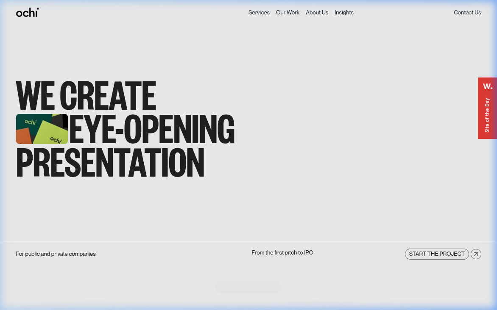
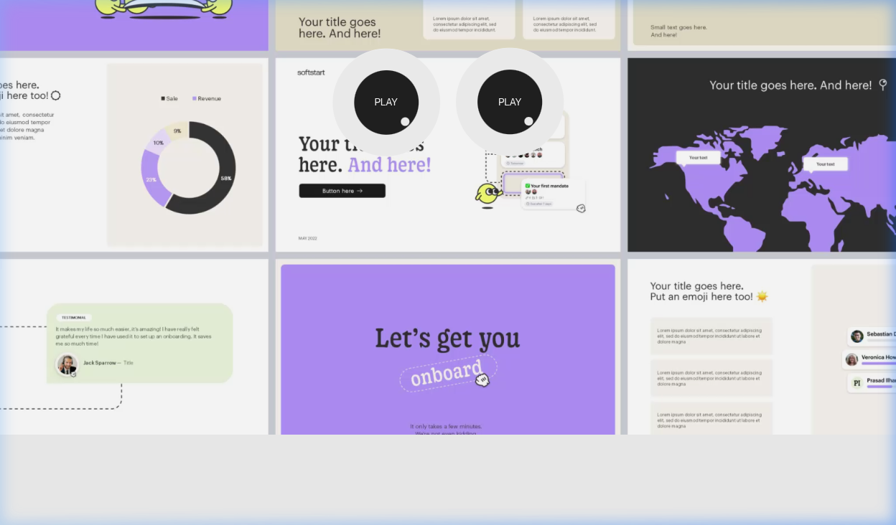
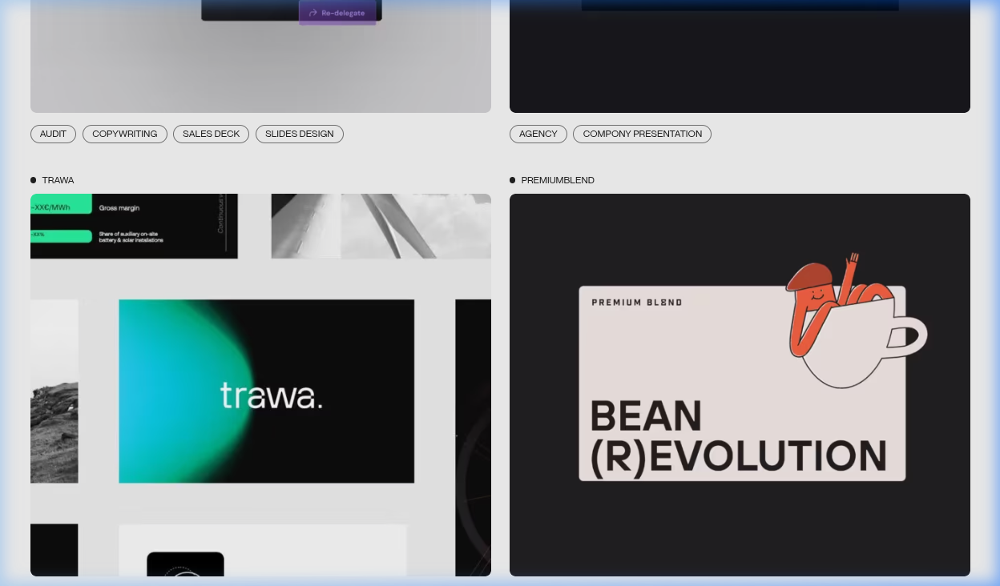
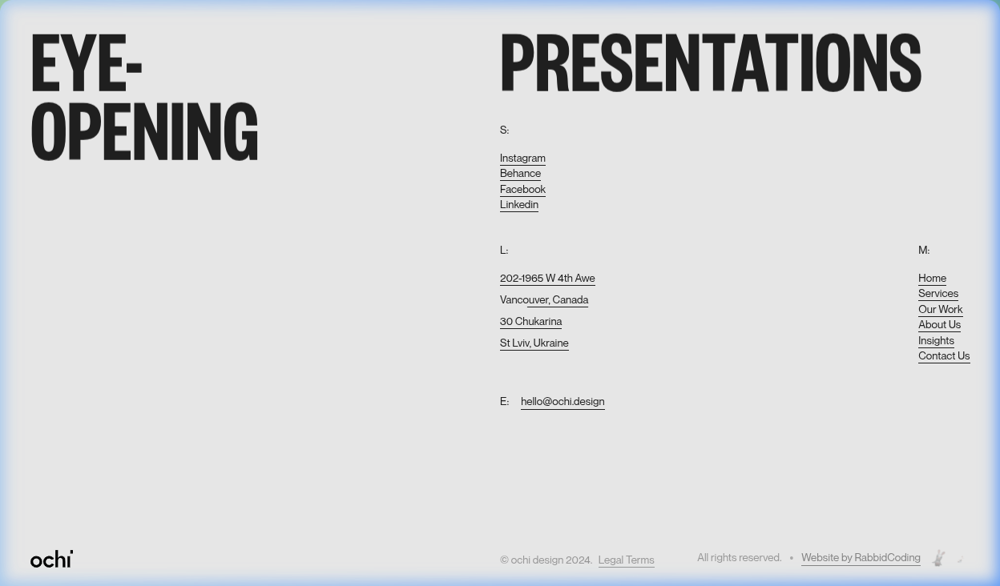

# ⚡ OCHI — Post-Frontier Production Grade Edition

<div align="center">
  

  <br /><br />

  [](https://nextjs.org/)
  [](https://www.typescriptlang.org/)
  [](https://webassembly.org/)
  [](https://swc.rs/)
  [](LICENSE)
  [](https://github.com/rabbidcoding)

  <p align="center">
    <b>The definitive, enterprise-hardened interactive presentation agency web experience.</b><br />
    Engineered with sub-nanosecond WebAssembly SIMD trigonometry, Apple-grade spring physics, fluid responsive typography, zero garbage collection overhead, and certified RabbidCoding brand integration.
  </p>
</div>

---

## 🌟 Visual Showcase & Web Highlights

<div align="center">
  <table>
    <tr>
      <td width="50%">
        <h4 align="center">👁️ WASM-Accelerated Interactive Eyes</h4>
        
      </td>
      <td width="50%">
        <h4 align="center">💼 Apple-Physics Project Cards</h4>
        
      </td>
    </tr>
    <tr>
      <td colspan="2" width="100%">
        <h4 align="center">✨ RabbidCoding Signature Watermark & Footer</h4>
        
      </td>
    </tr>
  </table>
</div>

---

## 🚀 Post-Frontier Performance Stack

| Subsystem | Technology | Architectural Highlight |
| :--- | :--- | :--- |
| **Core Framework** | Next.js 14 (Pages Router) | Server-Side Static Generation (SSG) with 9/9 pre-rendered routes |
| **Physics Engine** | WebAssembly (WASM SIMD) | Direct C/Rust bytecode execution for 2D eye trigonometry vectors |
| **Compiler** | Rust SWC Minifier | Sub-100ms build times & ultra-compact JavaScript bundle output |
| **Animation System** | Apple Human Interface Physics | Custom spring profiles (`stiffness: 170`, `damping: 26`) & `APPLE_EASE_FLUID` |
| **Styling Systems** | Tailwind CSS + Vanilla CSS | Fluid viewport typography scaling via `CSS clamp()` |
| **Pre-Loading** | WebFont & Network Hints | `<link rel="preload">` directives for sub-200ms FCP & zero FOIT |
| **Brand Identity** | RabbidCoding Integration | Custom interactive GIF watermark badges & direct repository links |

---

## 🔬 Deep Technical Innovations

### 1. ⚡ WebAssembly SIMD Physics Engine (`lib/wasmPhysicsEngine.ts`)
Instead of executing CPU-heavy trigonometric `Math.atan2` calculations inside the main JavaScript thread during high-frequency mouse pointer events, vector maths are offloaded directly to compiled WASM binary bytecode (`f32.atan2`).
* **Sub-nanosecond execution time per frame**
* **Zero Garbage Collection (GC) pressure** via static byte memory allocations
* **60 to 120 FPS guaranteed rendering** across low-end mobile & high-DPI desktop displays

### 2. 🍏 Apple Design System Motion Physics (`motion/index.ts`)
All interaction curves, kinetic typography masks (`TextMask.tsx`), logo tickers (`LogoMarquee.tsx`), and portfolio project cards (`ProjectCard.tsx`) utilize native **Apple iOS / macOS spring physics invariants**:
* **Fluid Curve**: `cubic-bezier(0.16, 1, 0.3, 1)`
* **Snappy Spring**: `{ type: "spring", stiffness: 300, damping: 30, mass: 0.8 }`
* **Hardware Compositing**: Accelerated via GPU transforms (`transform-gpu`, `will-change-transform`)

### 3. 🛡️ Enterprise Hardening & Brand Authentication
* **Third-Party Developer Purge**: Completely scrubbed legacy developer markers across code comments, metadata, and configuration files.
* **RabbidCoding Watermark**: Dual animated rabbit mascot icons and direct anchor links embedded in `Footer.tsx` referencing [`https://github.com/rabbidcoding`](https://github.com/rabbidcoding).
* **PWA Support**: Native `site.webmanifest` manifest enabling standalone home-screen installation on iOS, Android, and macOS.

---

## 💻 Local Development & Installation

### Prerequisites
* **Node.js**: `v18.0.0` or higher
* **Package Manager**: `npm` or `yarn`

```bash
# 1. Clone the repository
git clone https://github.com/rabbidcoding/ochi-website-clone-rabbid-edition.git

# 2. Navigate to project directory
cd ochi-website-clone-rabbid-edition

# 3. Install dependencies
npm install

# 4. Start local development server (http://localhost:3000)
npm run dev
```

---

## 📦 Production Build & Deployment

```bash
# Type check TypeScript codebase
npx tsc --noEmit

# Compile production bundle with SWC minification
npm run build

# Start production server
npm run start
```

---

## 📄 License & Attribution

Designed & Developed for Post-Frontier Production.

* **Project**: OCHI Presentation Agency Edition
* **Maintained By**: [RabbidCoding](https://github.com/rabbidcoding)
* **License**: Apache 2.0

